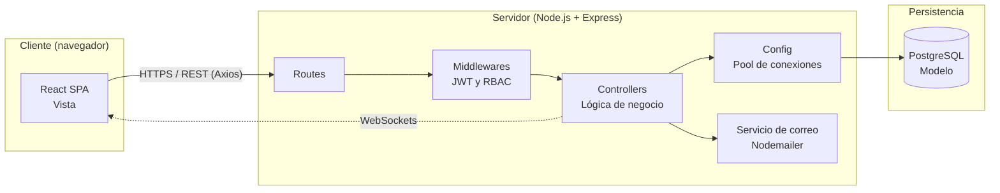
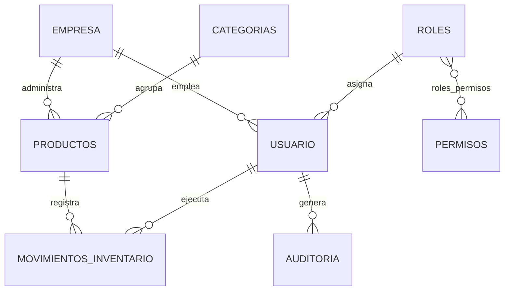

<div align="center">


# STOCKVELIA

### Plataforma web de gestión de inventarios y control financiero para microempresas y PYMES

**Monitoreo de existencias en tiempo real, alertas de stock mínimo, auditoría de movimientos y reportes exportables**

<br>


<br>

[Descripción](#1-descripción-del-proyecto) &nbsp;|&nbsp;
[Arquitectura](#3-arquitectura) &nbsp;|&nbsp;
[Estructura](#5-estructura-del-repositorio) &nbsp;|&nbsp;
[Instalación](#9-instalación-y-puesta-en-marcha) &nbsp;|&nbsp;
[API](#7-referencia-de-la-api) &nbsp;|&nbsp;
[Equipo](#16-equipo-de-desarrollo)

</div>

<br>

---

## Índice

| N° | Sección | N° | Sección |
|:--:|---------|:--:|---------|
| 01 | [Descripción del proyecto](#1-descripción-del-proyecto) | 10 | [Variables de entorno](#10-variables-de-entorno) |
| 02 | [Características principales](#2-características-principales) | 11 | [Scripts disponibles](#11-scripts-disponibles) |
| 03 | [Arquitectura](#3-arquitectura) | 12 | [Roles y permisos](#12-roles-y-permisos) |
| 04 | [Stack tecnológico](#4-stack-tecnológico) | 13 | [Flujo de trabajo y control de versiones](#13-flujo-de-trabajo-y-control-de-versiones) |
| 05 | [Estructura del repositorio](#5-estructura-del-repositorio) | 14 | [Despliegue](#14-despliegue) |
| 06 | [Modelo de datos](#6-modelo-de-datos) | 15 | [Gestión del proyecto](#15-gestión-del-proyecto) |
| 07 | [Referencia de la API](#7-referencia-de-la-api) | 16 | [Equipo de desarrollo](#16-equipo-de-desarrollo) |
| 08 | [Seguridad](#8-seguridad) | 17 | [Alcance, limitaciones y hoja de ruta](#17-alcance-limitaciones-y-hoja-de-ruta) |
| 09 | [Instalación y puesta en marcha](#9-instalación-y-puesta-en-marcha) | 18 | [Créditos](#18-créditos) |

---

## Ficha del proyecto

| | |
|:--|:--|
| **Proyecto** | StockVelia |
| **Tipo** | Aplicación web responsiva (SPA + API REST) |
| **Programa de formación** | Análisis y Desarrollo de Software |
| **Institución** | SENA - Centro de Gestión de Mercados, Logística y Tecnologías de la Información (CGMLTI) |
| **Ciudad** | Bogotá D.C., Colombia |
| **N° de ficha** | 3311976 |
| **Metodología** | Scrum, 5 sprints semanales |
| **Público objetivo** | Minimercados, tiendas de barrio, boutiques, ferreterías y emprendimientos en expansión |

---

## 1. Descripción del proyecto

StockVelia es una plataforma de gestión de inventarios que trasciende el registro tradicional de entradas y salidas para convertirse en una herramienta de inteligencia financiera y protección del capital operativo de las microempresas y PYMES.

La mayoría de estos negocios administra su mercancía con cuadernos, hojas de cálculo desconectadas o memoria operativa. Esto genera un drenaje silencioso de capital que StockVelia ataca de forma directa:

| Problema | Respuesta de StockVelia |
|----------|-------------------------|
| **Fugas de dinero y mermas invisibles** | Auditoría de cada movimiento con usuario, motivo, cantidad y fecha |
| **Quiebres de stock y ventas perdidas** | Alertas visuales automáticas al cruzar el stock mínimo configurado |
| **Capital atrapado en bodega** | Reportes de existencias y valoración económica del inventario |
| **Cero visibilidad financiera** | Dashboard con indicadores, historial filtrable y exportación a PDF y Excel |

El sistema está diseñado para que un comerciante sin conocimientos técnicos avanzados registre un producto y una transacción de inventario en menos de dos minutos, desde cualquier dispositivo.

---

## 2. Características principales

| Módulo | Capacidades |
|--------|-------------|
| **Autenticación y sesión** | Registro de empresa con su administrador, inicio de sesión con JWT, cierre de sesión con revocación de token, recuperación de contraseña por código enviado al correo |
| **Gestión de usuarios** | Alta, edición, consulta y baja lógica de cuentas por parte del administrador |
| **Control de acceso (RBAC)** | Validación del rol en cada petición; respuesta 403 ante acciones no autorizadas |
| **Catálogo de productos** | Código único por empresa, categoría, precio, stock y stock mínimo; baja lógica que preserva el historial |
| **Categorías** | Agrupación de productos en familias comerciales |
| **Movimientos de inventario** | Entradas (compra, devolución), salidas (venta) y bajas (daño) con validación transaccional de stock |
| **Stock en tiempo real** | Actualización simultánea de las cantidades en todas las terminales conectadas |
| **Alertas de stock bajo** | Resaltado en rojo e icono de advertencia cuando el stock es menor o igual al mínimo |
| **Búsqueda y filtros** | Búsqueda por nombre, código o categoría, y combinación de criterios múltiples |
| **Reportes** | Consolidado de existencias, historial por rango de fechas, trazabilidad por producto y exportación a PDF y Excel |
| **Auditoría** | Registro de acciones administrativas por usuario |

---

## 3. Arquitectura

StockVelia adopta un **monolito modular** basado en el patrón **Modelo-Vista-Controlador (MVC)**, con comunicación síncrona mediante API REST y comunicación asíncrona en tiempo real mediante WebSockets. Se evita deliberadamente la sobreingeniería de los microservicios para facilitar el despliegue, las pruebas y el mantenimiento por parte de equipos pequeños.



### Responsabilidad por capa

| Capa | Ubicación | Responsabilidad |
|------|-----------|-----------------|
| **Vista** | `frontend/src` | Renderizado de componentes, formularios, dashboard y alertas; consumo de la API |
| **Rutas** | `backend/src/routes` | Definición de endpoints y enrutamiento hacia los controladores |
| **Middlewares** | `backend/src/middlewares` | Verificación de JWT, control de acceso por roles y validación de entradas |
| **Controladores** | `backend/src/controllers` | Reglas de negocio y respuesta con los códigos HTTP adecuados |
| **Configuración** | `backend/src/config` | Conexión a PostgreSQL (`db.js`) y servicio de correo (`mailer.js`) |
| **Plantillas** | `backend/src/templates` | Plantillas de los correos transaccionales |
| **Persistencia** | PostgreSQL | Integridad referencial, transacciones ACID y trigger de actualización de stock |

### Flujo crítico: registro de una salida de inventario

1. El usuario selecciona el producto, indica la cantidad y confirma en la interfaz React.
2. El frontend envía `POST /api/movimientos` con el token JWT en la cabecera `Authorization`.
3. El middleware verifica la firma del token y los permisos del usuario.
4. El controlador valida que el producto pertenezca a la empresa del usuario.
5. La base de datos ejecuta la transacción: el trigger `trg_actualizar_stock` valida que no existan existencias negativas, descuenta el stock y deja el registro en `movimientos_inventario`.
6. Si el stock es insuficiente, la operación se aborta y se responde con error 400.
7. En caso de éxito se responde 201 y el nuevo stock se refleja en las terminales conectadas.

---

## 4. Stack tecnológico

| Capa | Tecnología | Uso en el proyecto |
|------|------------|--------------------|
| **Lenguaje** | JavaScript (ES6+) | Lenguaje único para cliente y servidor |
| **Frontend** | React | Interfaz de usuario basada en componentes |
| | React Router | Navegación entre vistas y protección de rutas privadas |
| | Axios | Cliente HTTP centralizado en `services/api.js` |
| | CSS3 | Estilos modulares por componente y vista, diseño responsivo |
| **Backend** | Node.js | Entorno de ejecución asíncrono |
| | Express | API REST, enrutamiento y middlewares |
| | JSON Web Token | Autenticación stateless con expiración |
| | Bcrypt | Hash y salting de contraseñas |
| | Nodemailer | Envío de códigos de recuperación de contraseña |
| | pg | Pool de conexiones a PostgreSQL |
| **Base de datos** | PostgreSQL | Modelo relacional, integridad referencial y lógica transaccional |
| **Herramientas** | Git y GitHub | Control de versiones y trabajo colaborativo |
| | Visual Studio Code | Entorno de desarrollo |
| | ClickUp | Tablero de planeación de sprints |
| | Figma | Prototipos de baja y alta fidelidad |

---

## 5. Estructura del repositorio

```text
StockVelia/
|-- backend/
|   |-- src/
|   |   |-- config/                 Conexión a la base de datos y servicio de correo
|   |   |-- controllers/            Lógica de negocio de cada módulo
|   |   |-- middlewares/            Autenticación JWT, RBAC y validaciones
|   |   |-- routes/                 Definición de endpoints de la API
|   |   |-- templates/              Plantillas de correos transaccionales
|   |   `-- index.js                Punto de entrada del servidor
|   |-- package.json
|   `-- package-lock.json
|
|-- frontend/
|   |-- public/                     Archivos estáticos
|   |-- src/
|   |   |-- assets/                 Recursos gráficos
|   |   |-- components/             Componentes reutilizables y módulos del dashboard
|   |   |-- pages/                  Vistas principales de la aplicación
|   |   |-- services/               Comunicación con el backend (Axios)
|   |   |-- styles/                 Hojas de estilo modulares
|   |   |-- App.js                  Componente raíz y enrutamiento
|   |   |-- App.css
|   |   |-- App.test.js             Pruebas del componente raíz
|   |   |-- index.js                Punto de entrada del cliente
|   |   |-- index.css
|   |   |-- logo.svg
|   |   |-- reportWebVitals.js
|   |   `-- setupTests.js
|   |-- package.json
|   |-- package-lock.json
|   `-- README.md
|
|-- .gitignore
|-- package.json
|-- package-lock.json
`-- README.md                       Este documento
```

### Convención de nombres

| Elemento | Convención | Ejemplo |
|----------|------------|---------|
| Controladores | `<entidad>Controller.js` | `productoController.js` |
| Rutas | `<entidad>Routes.js` | `productoRoutes.js` |
| Componentes React | PascalCase | `CatalogView.jsx` |
| Servicios del cliente | camelCase | `api.js` |
| Tablas SQL | snake_case en plural | `movimientos_inventario` |

---

## 6. Modelo de datos

El diseño relacional está normalizado hasta la **Tercera Forma Normal (3NF)** sobre PostgreSQL.



| Grupo | Tablas |
|-------|--------|
| **Nucleares** | `empresa`, `roles`, `permisos`, `roles_permisos`, `categorias`, `usuario` |
| **Operacionales** | `productos`, `movimientos_inventario` |
| **Soporte y seguridad** | `auditoria`, `tokens_blacklist`, `codigos_recuperacion` |

### Reglas de integridad destacadas

| Regla | Implementación |
|-------|----------------|
| Código de producto único | Restricción `UNIQUE` sobre `codigo` |
| Valores no negativos | `CHECK (precio >= 0)`, `CHECK (stock >= 0)`, `CHECK (stock_minimo >= 0)` |
| Movimientos válidos | `CHECK (tipo_movimiento IN ('ENTRADA','SALIDA','BAJA'))` y `CHECK (cantidad > 0)` |
| Stock consistente | Trigger `trg_actualizar_stock` que ejecuta `actualizar_stock()` en cada inserción de movimiento |
| Identificadores | Formato `VARCHAR(20)` generado con `generar_id_formateado()` y una secuencia global |
| Borrado lógico | Campo `estado` en productos y usuarios para preservar la trazabilidad histórica |

### Ciclo de vida de un producto

| Estado | Condición |
|--------|-----------|
| **Registrado** | Alta inicial en el catálogo |
| **Activo** | `stock > stock_minimo` |
| **Crítico** | `stock <= stock_minimo`, con alerta visual permanente |
| **Agotado** | `stock = 0`, solo admite entradas |
| **Inactivo** | Baja lógica; se oculta de los listados activos |

---

## 7. Referencia de la API

URL base de desarrollo: `http://localhost:<PORT>/api`

Los endpoints protegidos requieren la cabecera `Authorization: Bearer <JWT>`.

### Autenticación `/api/auth`

| Método | Ruta | Acceso | Descripción |
|:------:|------|:------:|-------------|
| `POST` | `/api/auth/register` | Público | Registra una empresa y su usuario administrador |
| `POST` | `/api/auth/login` | Público | Autentica y devuelve un JWT con vigencia de 2 horas |
| `POST` | `/api/auth/forgot-password` | Público | Envía un código de 6 dígitos (vigencia de 15 minutos) al correo |
| `POST` | `/api/auth/reset-password` | Público | Restablece la contraseña con el código recibido |
| `POST` | `/api/auth/logout` | Autenticado | Revoca el token mediante lista negra |

### Productos `/api/productos`

| Método | Ruta | Descripción |
|:------:|------|-------------|
| `POST` | `/api/productos` | Crea un producto verificando la unicidad del código |
| `GET` | `/api/productos` | Lista los productos activos de la empresa con su categoría |
| `PUT` | `/api/productos/:id` | Actualiza los atributos de un producto |
| `DELETE` | `/api/productos/:id` | Baja lógica del producto |

### Categorías `/api/categorias`

| Método | Ruta | Descripción |
|:------:|------|-------------|
| `POST` | `/api/categorias` | Crea una categoría |
| `GET` | `/api/categorias` | Lista las categorías en orden alfabético |

### Movimientos `/api/movimientos`

| Método | Ruta | Descripción |
|:------:|------|-------------|
| `POST` | `/api/movimientos` | Registra una entrada, salida o baja de stock |
| `GET` | `/api/movimientos` | Devuelve el historial de movimientos de la empresa |

### Usuarios `/api/usuarios`

| Método | Ruta | Descripción |
|:------:|------|-------------|
| `GET` | `/api/usuarios?id_empresa=` | Lista los usuarios de una empresa |
| `POST` | `/api/usuarios` | Crea un usuario secundario con validación de contraseña |
| `PUT` | `/api/usuarios/estado/:id` | Alterna el estado activo o inactivo de un usuario |

### Ejemplo: registrar una salida

```http
POST /api/movimientos
Authorization: Bearer <JWT>
Content-Type: application/json

{
  "id_producto": 12,
  "tipo_movimiento": "SALIDA",
  "motivo": "VENTA",
  "cantidad": 2,
  "observacion": "Factura de venta #0012"
}
```

### Códigos de respuesta

| Código | Significado |
|:------:|-------------|
| `200` / `201` | Operación exitosa / recurso creado |
| `400` | Datos inválidos, duplicados o stock insuficiente |
| `401` | Token ausente, revocado o credenciales incorrectas |
| `403` | Token inválido, cuenta desactivada o rol sin permisos |
| `404` | Recurso inexistente o ajeno a la empresa |
| `423` | Cuenta bloqueada temporalmente por intentos fallidos |
| `500` | Error interno del servidor |

---

## 8. Seguridad

| Mecanismo | Descripción |
|-----------|-------------|
| **Autenticación stateless** | Tokens JWT firmados con expiración corta |
| **Revocación de sesiones** | Lista negra de tokens al cerrar sesión |
| **Hash de contraseñas** | Bcrypt con salting; mínimo 6 caracteres con mayúscula, minúscula y número |
| **Control de acceso por roles** | Validación del rol en cada petición mediante middleware |
| **Protección contra fuerza bruta** | Bloqueo temporal de cuenta tras intentos fallidos consecutivos |
| **Mensajes de error genéricos** | Evitan revelar si un correo existe o qué dato falló |
| **Aislamiento multiempresa** | Cada consulta se acota a la empresa del usuario autenticado |
| **Integridad transaccional** | Transacciones ACID y trigger de validación de stock |
| **Cifrado en tránsito** | HTTPS para la API y WSS para WebSockets en producción |
| **Política CORS** | Configuración restrictiva a nivel de servidor |
| **Secretos fuera del repositorio** | Credenciales y llaves en variables de entorno (`.env`), excluidas por `.gitignore` |
| **Borrado lógico y auditoría** | Preservan la trazabilidad de usuarios y productos |

---

## 9. Instalación y puesta en marcha

### Requisitos previos

| Herramienta | Versión recomendada |
|-------------|---------------------|
| Node.js | 18 LTS o superior |
| npm | 9 o superior |
| PostgreSQL | 14 o superior |
| Git | 2.30 o superior |

### Paso 1. Clonar el repositorio

```bash
git clone https://github.com/jonathanjimeneza343-source/StockVelia.git
cd StockVelia
```

### Paso 2. Crear la base de datos

```bash
psql -U postgres -c "CREATE DATABASE stockvelia;"
psql -U postgres -d stockvelia -f <ruta_al_script_de_la_base_de_datos>.sql
```

El script crea las tablas, restricciones, la función `generar_id_formateado()` y el trigger `trg_actualizar_stock`.

### Paso 3. Configurar y ejecutar el backend

```bash
cd backend
npm install
cp .env.example .env      # complete los valores (ver sección 10)
npm start
```

### Paso 4. Configurar y ejecutar el frontend

```bash
cd frontend
npm install
cp .env.example .env      # defina la URL de la API
npm start
```

### Verificación

| Servicio | URL por defecto |
|----------|-----------------|
| Frontend | `http://localhost:3000` |
| API | `http://localhost:<PORT>/api` |

---

## 10. Variables de entorno

Los archivos `.env` no se versionan. Cree uno por cada servicio a partir de las siguientes plantillas.

### `backend/.env`

```env
# Servidor
PORT=5000
NODE_ENV=development

# Base de datos PostgreSQL
DB_HOST=localhost
DB_PORT=5432
DB_NAME=stockvelia
DB_USER=postgres
DB_PASSWORD=<contraseña>

# CORS
CLIENT_URL=http://localhost:3000
```

### `frontend/.env`

```env
REACT_APP_API_URL=http://localhost:5000/api
```

| Regla | Detalle |
|-------|---------|
| No versionar secretos | Verifique que `.env` esté en `.gitignore` |
| Rotación | Cambie `JWT_SECRET` y las credenciales ante cualquier sospecha de exposición |
| Producción | Use secretos distintos a los de desarrollo y gestionados por la plataforma de hosting |

---

## 11. Scripts disponibles

| Ubicación | Comando | Función |
|-----------|---------|---------|
| `backend/` | `npm start` | Inicia el servidor de la API |
| `backend/` | `npm run dev` | Inicia el servidor con recarga automática (si se configura `nodemon`) |
| `frontend/` | `npm start` | Servidor de desarrollo con recarga en caliente |
| `frontend/` | `npm test` | Ejecuta las pruebas del cliente |
| `frontend/` | `npm run build` | Genera el paquete optimizado de producción |

---

## 12. Roles y permisos

| Capacidad | Administrador | Empleado |
|-----------|:-------------:|:--------:|
| Registrar la empresa y configurar parámetros globales | Sí | No |
| Gestionar usuarios (crear, editar, baja lógica) | Sí | No |
| Crear y editar productos | Sí | Según configuración |
| Baja lógica de productos | Sí | No |
| Registrar entradas y salidas | Sí | Sí |
| Consultar stock y alertas | Sí | Sí |
| Consultar historial de movimientos | Sí | Sí |
| Generar y exportar reportes | Sí | No |

---

## 13. Flujo de trabajo y control de versiones

### Ramas

| Rama | Propósito |
|------|-----------|
| `main` | Código estable y listo para producción |
| `develop` | Integración de las funcionalidades del sprint en curso |
| `feature/<historia>-<descripcion>` | Desarrollo de una historia de usuario |
| `fix/<descripcion>` | Corrección de defectos |
| `hotfix/<descripcion>` | Corrección urgente sobre producción |

### Convención de commits

Se utiliza el formato **Conventional Commits**:

```text
<tipo>(<ámbito>): <descripción en imperativo>
```

| Tipo | Uso |
|------|-----|
| `feat` | Nueva funcionalidad |
| `fix` | Corrección de un defecto |
| `docs` | Cambios en documentación |
| `style` | Formato sin cambio de lógica |
| `refactor` | Reestructuración sin cambio funcional |
| `test` | Pruebas |
| `chore` | Mantenimiento y configuración |

Ejemplo: `feat(movimientos): validar stock insuficiente antes de registrar la salida`

### Proceso de integración

1. Crear la rama de la historia desde `develop`.
2. Desarrollar y confirmar cambios con commits descriptivos.
3. Abrir un Pull Request hacia `develop` referenciando el identificador de la historia (por ejemplo, `HU-012`).
4. Obtener la revisión de al menos un integrante del equipo.
5. Fusionar tras superar la revisión y las pruebas.

---

## 14. Despliegue

Arquitectura de producción prevista:

| Nodo | Descripción |
|------|-------------|
| **Cliente** | Navegador moderno; conexiones cifradas HTTPS y WSS |
| **Servidor de aplicación** | Contenedor del frontend estático servido mediante Nginx y contenedor del backend Node.js con la API REST y WebSockets |
| **Base de datos** | PostgreSQL gestionado y aislado, con copias de seguridad automáticas |

| Elemento | Especificación |
|----------|----------------|
| **Hosting** | VPS o PaaS en la nube (por ejemplo, AWS Lightsail, DigitalOcean, Render o Railway) |
| **Contenedores** | Frontend, backend y base de datos independientes |
| **Proxy inverso** | Redirección de tráfico y terminación SSL |
| **Certificados** | Let's Encrypt |
| **Monitoreo base** | Registro de logs de peticiones y control del estado de los servicios |

---

## 15. Gestión del proyecto

El desarrollo sigue **Scrum** en cinco sprints, uno por semana. El seguimiento se realiza en ClickUp y en el registro de Daily Scrum del equipo.

| Sprint | Enfoque | Historias de usuario |
|:------:|---------|----------------------|
| **1** | Acceso y base de usuarios | HU-001, HU-002, HU-003, HU-006 |
| **2** | Administración de usuarios e historial | HU-004, HU-005, HU-017, HU-018 |
| **3** | Catálogo de productos | HU-007, HU-008, HU-009, HU-010 |
| **4** | Movimientos y stock | HU-011, HU-012, HU-013, HU-014 |
| **5** | Alertas, reportes, exportación y despliegue cloud | HU-015, HU-016, HU-019, HU-020 |

### Roles Scrum

| Rol | Responsabilidad |
|-----|-----------------|
| **Product Owner y Diseñador de Base de Datos** | Gestión del backlog, criterios de aceptación y modelado conceptual, lógico y físico de datos |
| **Scrum Master y Analista de Calidad (QA)** | Facilitación del marco ágil y estrategia de pruebas |
| **Desarrollo Backend** | API REST, reglas de negocio, seguridad y optimización de consultas |
| **Desarrollo Frontend y UX/UI** | Interfaces responsivas, validaciones y consumo de la API |

### Estrategia de calidad

| Tipo de prueba | Alcance |
|----------------|---------|
| **Funcionales** | Caja negra sobre cada historia de usuario |
| **Integración** | Flujo entre frontend, API y base de datos |
| **Concurrencia** | Transacciones simultáneas de entrada y salida sin pérdida de consistencia |
| **Seguridad** | Inyección, escalamiento de privilegios y control de acceso por roles |
| **Rendimiento** | Respuesta de vistas y consultas de stock por debajo de 2 segundos |

---

## 16. Equipo de desarrollo

| Integrante |
|------------|
| Ivonne Dayana Sanchez Contreras |
| Jaider Andrés González Ovalle |
| Alan Felipe Caro Olaya |
| Jonathan Andres Jimenez Aguilera |

**Instructores:** Jeysson Contreras, Eduardo Foglia y Freddy Ardila.

---

## 17. Alcance, limitaciones y hoja de ruta

### Fuera del alcance de la versión inicial

| Exclusión | Detalle |
|-----------|---------|
| Pasarelas de pago | Sin integración con Stripe, PayPal o PSE |
| Facturación electrónica | Sin conexión con entes tributarios |
| Aplicación móvil nativa | Solo aplicación web responsiva |
| Integración logística | Sin cotización de fletes ni guías de despacho |
| Lectura por cámara | Sin escáner de códigos de barras por cámara del celular |
| Analítica predictiva | Sin modelos de Machine Learning |
| Alertas externas | Notificaciones solo visuales dentro de la plataforma, sin correo ni SMS |
| Nómina y recursos humanos | Sin gestión de salarios ni horarios |

### Limitaciones conocidas

| Limitación | Detalle |
|------------|---------|
| Conectividad | Requiere conexión estable a Internet para la sincronización en tiempo real |
| Hardware externo | Sin integración nativa con lectores láser ni impresoras térmicas |
| Alcance financiero | Enfocado en inventarios y valoración de mercancía; no sustituye un módulo contable |

### Hoja de ruta

| Mejora propuesta | Prioridad |
|------------------|:---------:|
| Aplicación móvil y lectura de códigos por cámara | Media |
| Alertas por correo electrónico y mensajería | Media |
| Módulos de proveedores, compras, clientes y ventas | Alta |
| Soporte multiempresa con permisos granulares | Alta |
| Analítica predictiva de demanda y rotación | Baja |
| Integración con facturación electrónica | Media |

---

## 18. Créditos

<div align="center">


**StockVelia**

Proyecto desarrollado por aprendices del programa Análisis y Desarrollo de Software

**SENA - Centro de Gestión de Mercados, Logística y Tecnologías de la Información (CGMLTI)**

Bogotá D.C., Colombia

Ivonne Dayana Sanchez Contreras &nbsp;|&nbsp; Jaider Andrés González Ovalle &nbsp;|&nbsp; Alan Felipe Caro Olaya &nbsp;|&nbsp; Jonathan Andres Jimenez Aguilera

</div>